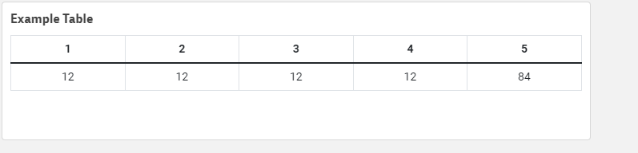

# DynamicTableCard
Task. Create table with 1 dimension and 1 measure. Must look like Multiple KPI with quick selection mode 

# How to install 
Upload /output/DynamicTableCard.zip to QlikSense

# How to change: 
1. Clone repo
2. npm install 
3. bower install 
4. gulp

All distr files save in folder "distr"

In folder ouput zip file - which ready to be uploaded

